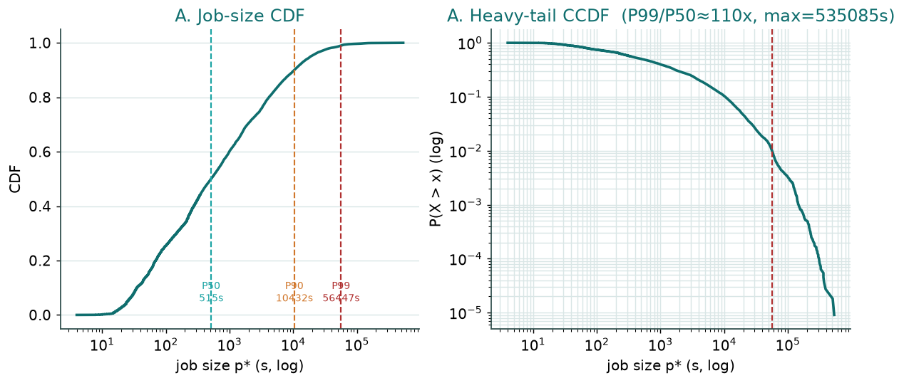
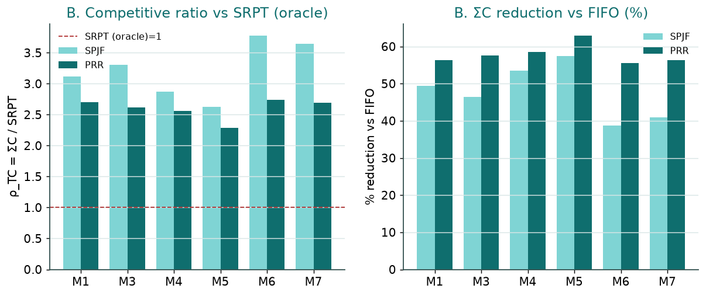
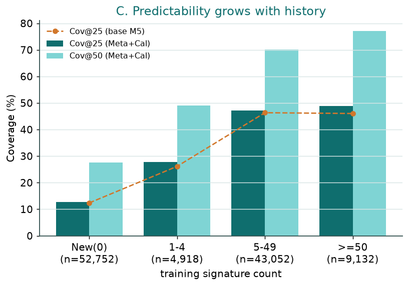
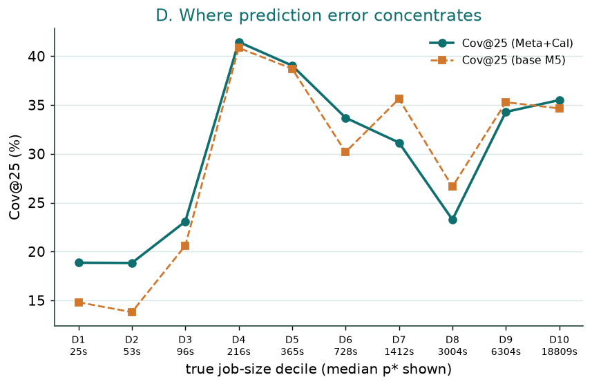
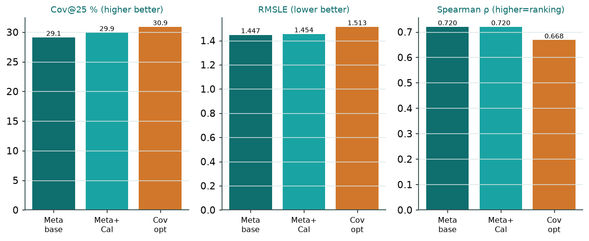

# Figures — heavy tails, ranking value, predictability, and the calibration trade-off

Read-only from committed Path B + Task-2 artifacts. No experiments/selection/tuning. Invariants re-checked (`invariant_check.json`): I1 split ordered + test-window frac=1.0, predictions aligned to test rows; I2/I3/I4 inherited from Path B V1-V8.

## A. Job-size distribution (CDF + heavy-tail CCDF)

- **Insight:** Job sizes are extremely heavy-tailed (P50=515s, P90=10432s, P99=56447s, max=535085s; P99/P50≈110x), so a handful of giant jobs dominate ΣC_j/SRPT and structurally inflate competitive ratios.
- **Caveat:** Tail is the TEST set's true p*; the single-machine sims treat this parallel fork-join span as a serial size (a modeling choice, not measured here).
- Data: `A_pstar_distribution.csv` (+ `A_pstar_percentiles.csv` for A).

## B. Predictor improvement vs FIFO and competitive ratio vs SRPT

- **Insight:** Every predictor cuts ΣC by ~56-63% vs FIFO (best PRR=M5, 63%), so the predicted ranking genuinely helps even though ρ vs SRPT stays 2.3-3.8.
- **Caveat:** ρ is vs the clairvoyant SRPT optimum (Point 1 of the audit); the large ρ is a normalization choice, not predictor failure. Spearman of the fed ranking varies by method.
- Data: `B_fifo_vs_srpt.csv` (+ `A_pstar_percentiles.csv` for A).

## C. Cov@25/50 vs training signature-count bucket

- **Insight:** Cov@25 rises monotonically with history (New=12.7% -> >=50=48.9%); the cold-start bottleneck is the New bucket, which is 48% of test.
- **Caveat:** 'New' (fine-signature unseen) may still share coarser keys with train; bucket counts are the train fine-signature count, the same definition used in Path B.
- Data: `C_cov_by_recurrence.csv` (+ `A_pstar_percentiles.csv` for A).

## D. Cov@25 by true-size decile

- **Insight:** Counter to the 'error is in the heavy tail' intuition, Cov@25 is LOWEST at the smallest jobs (D1-D2, median 53s, ~19%), peaks mid-range (D4=41.5%), and the heavy tail D10 (median 18809s) is only middling (35.5%); so prediction is hardest for tiny jobs, while the tail jobs that dominate scheduling cost are predicted moderately well.
- **Caveat:** Buckets are TRUE-size deciles; Cov@25 is a relative-error metric, so very small jobs are penalized by tiny absolute errors (a metric artifact, not necessarily larger absolute error). Computed from existing test predictions, no retraining.
- Data: `D_cov_by_size_decile.csv` (+ `A_pstar_percentiles.csv` for A).

## E. Calibration / ranking trade-off

- **Insight:** Isotonic calibration nudges Cov@25 29.1->29.9 while preserving rank (Spearman 0.720); the coverage-optimized variant reaches Cov@25 30.9 but worsens RMSLE (1.447->1.513) and breaks rank (Spearman 0.668) — which is why scheduling keeps the uncalibrated ranking.
- **Caveat:** The Task-2 'coverage-opt' differs in model+objective+calibration (not a pure calibration ablation); only the Meta-base vs Meta+Cal pair isolates isotonic calibration.
- Data: `E_calibration_tradeoff.csv` (+ `A_pstar_percentiles.csv` for A).
